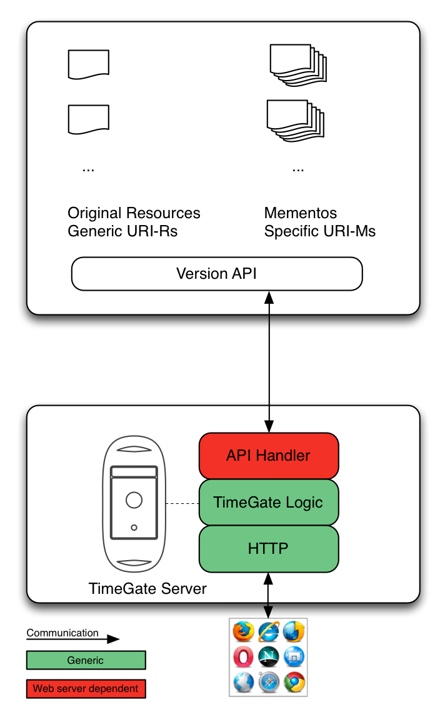

.. _big_picture:

Big picture
===========

Definitions
-----------

From now on, this documentation will refer to the web server where
resources and archives are as the **web server** and to the Memento
TimeGate datetime negotiation server as the **TimeGate**.

-  Suppose you have a web resource accessible in a web server by some
   URI. We call the resource the **Original Resource** and refer to its
   URI as **URI-R**.
-  Suppose a web server has a snapshot of what this URI-R looked like in
   the past. We call such a snapshot a **Memento** and we refer to its
   URI as **URI-M**. There could be many snapshots of URI-R, taken at
   different moments in time, each with their distinct URI-Ms. The
   Mementos do not necessary need to be in the same web server as the
   Original Resources.

Client, Server and TimeGate
---------------------------

This figure represents the current situation; Without date time
negotiation, the client has to find by hand the URIs for the previous
versions of a web resource. If they exists: |client_server.png| To make
this web resources Memento compliant, two things need to be added. The
new components of the systems are the TimeGate and Memento HTTP headers
at the web server's side: |client_server_tg.png| With these links, the
client now gets the address of the TimeGate when retrieving an Original
Resource or a Memento. Then, he can use datetime negotiation with the
TimeGate to get the URI of an archived version (``URI-M2``) of the
Original Resource at specific a point in time (``T2``): |sequence.png|

Architecture
------------

The TimeGate will manage the framework's logic in a generic manner.
However, every web server has its specific way to store snapshots and to
construct URI-Ms. Thus, a specific plugin must be written for every web
server. Such a plugin is called a handler. A handler will typically talk
to an API to return the list of URI-Ms given a URI-R, but there are
several alternatives to this setup.

   architecture.png

The system can be seen as three components.

-  The Memento user who wishes to retrieve an older version of a
   resource
-  The web server where the active version (original URI) and revisions
   (mementos) can be accessed. This entity must provide a way to access
   these versions. Typically through an API.
-  The TimeGate which itself is composed of two main elements:
-  One API-specific handler
-  The generic TimeGate code

.. |client_server.png| image:: client_server.png
.. |client_server_tg.png| image:: client_server_tg.png
.. |sequence.png| image:: sequence.png
