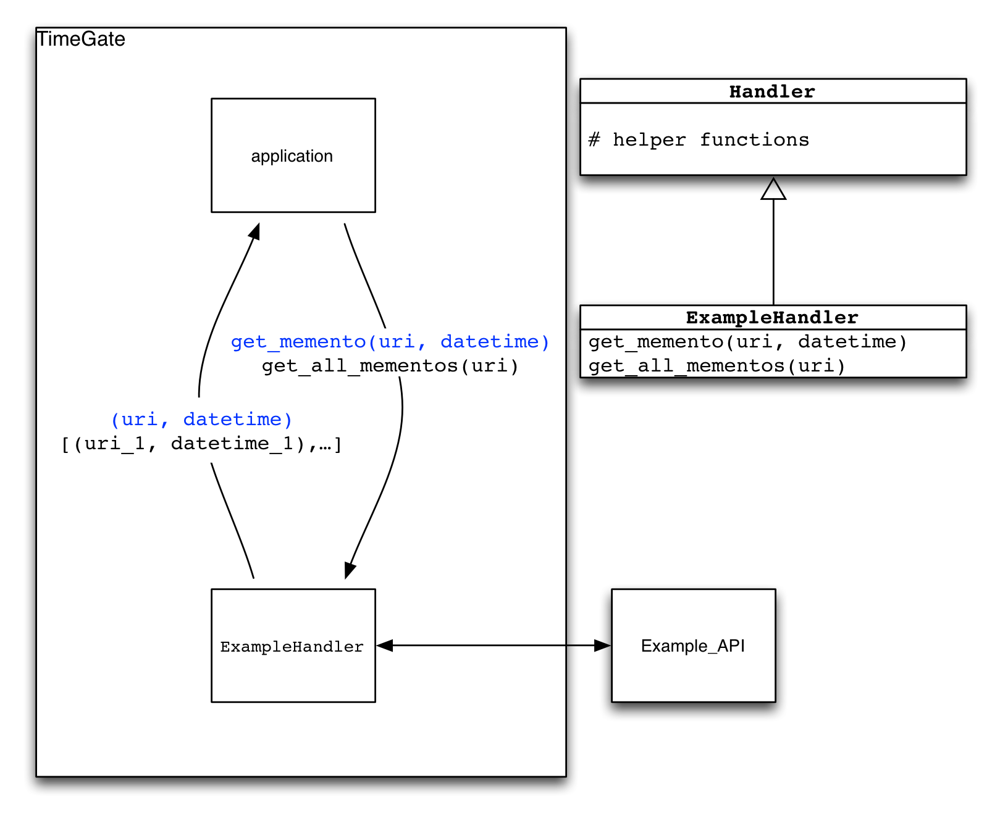

.. _handler:

Resources-specific Handler
==========================

A handler is a python class that is plugged into the generic TimeGate to
fit any specific technique a web server has to manage its Original
Resources and Mementos. Its role is simple: to retrieve the list of
URI-Ms (with their archival dates) given a URI-R. It typically does so
by connecting to an API.

Alternatives
------------

-  If no API is present: The list can be retrieved from many different
   ways. Page scraping, rule-based or even in a static manner. Anything
   will do.
-  If the history cannot be retrieved entirely: The handler can
   implement an alternative function that returns one single URI-M and
   its archival datetime given both URI-R and the datetime the user
   requested.
-  If the TimeGate's algorithms that select the best Memento for a
   requested date do not apply to the system: Implementing the
   alternative function could also be used to bypass these algorithms.
   This is particularly useful if there are performance concerns,
   special cases or access restriction for Mementos.

Requirements
------------

A handler require to have the following:

-  It must a python file placed in the ``core.handler`` module (which is
   the ``core/handler/`` folder). And it must be unique. If several
   classes are needed, or to switch quickly between handlers, consider
   adding the handler module path manually in the configuration
   file.  (See :ref:`configuration`.)
-  A handler must extend the ``core.handler_baseclass.Handler``
   base-class.
-  Implement at least one of the following:

   - ``get_all_mementos(uri_r)`` class function: This function is called
     by the TimeGate to retrieve the history an original resource
     ``uri_r``. The parameter ``uri_r`` is a Python string representing
     the requested URI-R. The return value must be a list of 2-tuples:
     ``[(uri_m1, date1), (uri_m2, date2), ...]`` . Each pair
     ``(uri_m, date)`` contains the URI of an archived version of R
     ``uri_m``, and the date at which it was archived ``date``.
   - ``get_memento(uri_r, requested_date)`` class function (alternative):
     This function will be called by the TimeGate to retrieve the best
     Memento for ``uri_`` at the date ``date``. Use it if the API cannot
     return the entire history for a resource efficiently or to bypass the
     TimeGate's best Memento selection. The parameter ``uri_r`` is a
     Python string representing the requested URI-R. The parameter
     ``date`` is a Python ``datetime.DateTime`` object. In this case, the
     return value will contain only one 2-tuple: ``(uri_m, date)`` which
     is the best memento that the handler could provide taking into
     account the limits of the API.

-  Input parameters:

   -  All parameter values ``uri_r`` are Python strings representing the
      user's requested URI-R.
   -  All parameter values ``requested_date``\ are ``datetime.DateTime``
      objects representing the user's requested datetime.

-  Output return values:

   -  All return values ``uri_m`` must be strings.
   -  All return values ``date`` must be strings representing dates. Prefer
      the `ISO 8601 <http://en.wikipedia.org/wiki/ISO_8601>`__ format for
      the dates.

-  Note that:

   - If both functions are implemented,
     ``get_memento(uri_r, requested_date)`` will always be used for
     TimeGate requests.
   - If the TimeMap advanced feature (see :ref:`advanced_features`) is enabled,
     ``get_all_mementos(uri_r)`` must be implemented.

Example
-------

A simple example handler is provided in\ ``core/handler/`` and can be
edited to match your web server's requirements: - See
`example.py <https://github.com/mementoweb/timegate/blob/master/core/handler/example.py>`__
Which returns static lists.

Other handlers examples are provided for real world APIs in
``core/handler_examples/`` for instance:

- `arXiv.py
  <https://github.com/mementoweb/timegate/blob/master/core/handler_examples/arxiv.py>`__
  Where the Original Resources are the e-prints of http://arxiv.org/ -
- `wikipedia.py
  <https://github.com/mementoweb/timegate/blob/master/core/handler_examples/wikipedia.py>`__
  Where the Original Resources are the articles of https://www.wikipedia.org/
- `github.py
  <https://github.com/mementoweb/timegate/blob/master/core/handler_examples/github.py>`__
  Where the Original Resources are the repositories, trees (branches and
  directories), files and raw files.

Other scraping Handlers examples are provided for real world resources
without any API:

- `can.py
  <https://github.com/mementoweb/timegate/blob/master/core/handler_examples/can.py>`__
  Where the Original Resources are the archives stored in
  http://www.collectionscanada.gc.ca/webarchives/
